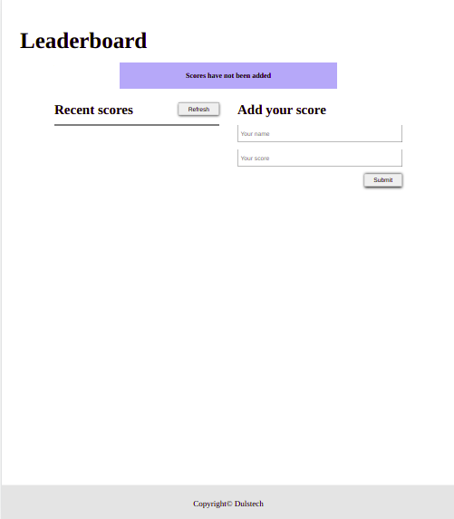
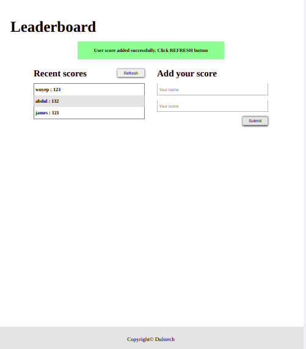
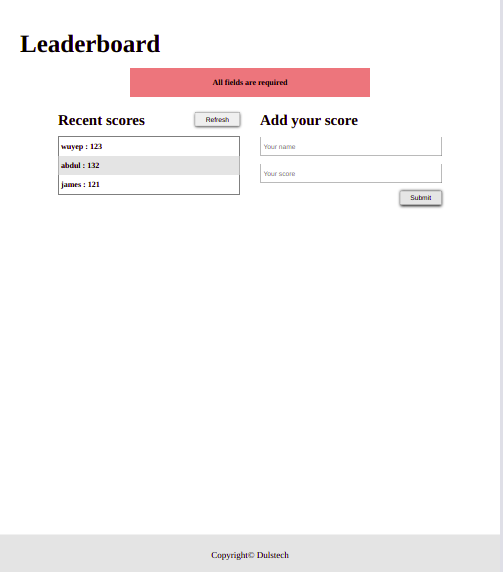

# Leaderboard

Leaderboard is a website that that preserves user input and displays scores submitted by different players. Built using JavaScript, HTMl, CSS and webpack

## Screenshots





## Live Demo

[Live Demo Link](https://wuyepabdul.github.io/leader-board/)

## Built With

- HTML
- CSS
- JS
- Lots of love :heart:

## Getting Started

**To clone this project**
**Run command: $git clone https://github.com/wuyepabdul/leader-board**
**or press the green Code button in the upper right corner and choose to download from the Download ZIP link.**

### Prerequisites

- Code editor (VS Code, Sublime, Atom)

## Run Tests

```
npx test
```

## Authors:

👤 **Abdul Wuyep**

[<code></code>](https://www.github.com/wuyepabdul)
[<code></code>](https://twitter.com/nikoescobal)
[<code></code>](https://www.linkedin.com/in/abdul-wuyep-6a27721b8/)
<a href="mailto:abdul.wuyep@gmail.com?subject=Hey Abdul!"></a>


## 🤝 Contributing

Contributions, issues and feature requests are welcome!

Feel free to check the [issues page](https://github.com/wuyepabdul/Todo-List/issues).

## Show your support

Give a ⭐️ if you like this project!

## Acknowledgments

- Microverse

## 📝 License

This project is [MIT](./MIT.md) licensed.
